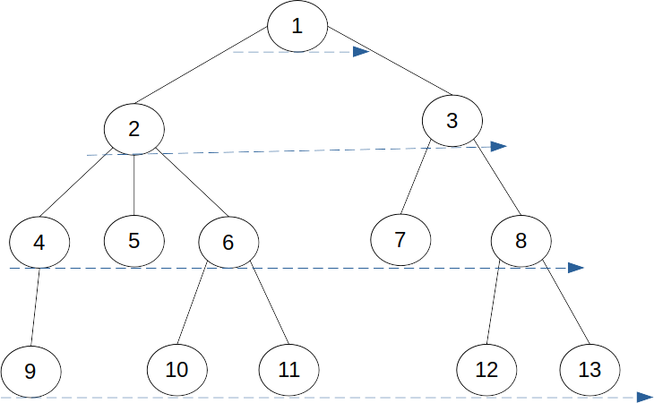

# BFS (Breadth-First Search)

너비 우선 탐색.

- 트리 탐색 예시

  

  1. 루트에서 **모든 자식** 차례로 방문

  2. 루트의 자식의 자식 모두 차례로 방문

  ...
  
  루트에서 거리 순으로 방문한다.


- 무향 그래프 탐색 예시

  1. (시작) 정점으로 정해진 정점을 방문한다.
  2. 1에서 방문한 정점에 인접한 정점을 모두 방문한다.
  3. 모든 정점을 방문할 때 까지 반복한다.

  

  그래프에서 각 정점을 처음 방문할 때 사용한 간선들만 남긴 것을 너비 우선 트리라고 한다.


- 수도 코드

  ```pseudocode
  BFS(G,s){ // s: 시작 정점
  	for each v:V-{s} 
  		visited[v] <- NO;
  	visited[s] <- YES;
  	enqueue(Q,s): // Q: 큐
  	
  	while(Q!=empty){
  		u <- dequeue(Q)
  		for each v:L(u) // L(u): 정점 u의 인접 정점 집합
  			if(visited[v]=NO) then{
  				visited[v] <- YES;
  				enqueue(Q,v);
  			}
  	}
  }
  ```


- 수행 시간

  ```
   Θ(V+E)
  ```

  

