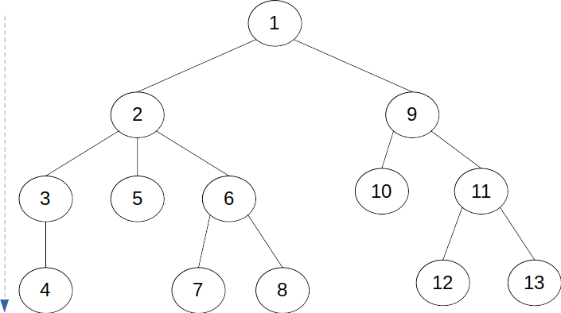

# DFS (Depth-First Search)

깊이 우선 탐색.

그래프의 모든 정점을 방문하는 방법 중의 하나이다.


- 트리 탐색 예시



	1. 루트의 자식 정점을 하나 방문한 다음 아래로 내려갈 수 있는 곳까지 내려간다.
	1. 더 이상 내려갈 수가 없으면 위로 되돌아오다가 내려갈 곳이 있으면 즉각 내려간다.


- 수도 코드

  ```pseudocode
  DFS(v){
  	visited[v] <- YES
  	for each x : L(v) // L(v): 정점 v의 인접 정점 집합
  		if(visited[x]=NO) then DFS(X); // 재귀함수로 구현
  }
  ```

  

- 수행 시간

  ```
   Θ(V+E)
  ```

  
