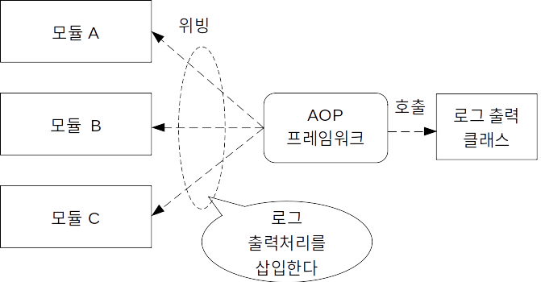

# AOP (Aspect Oriented Programming)
관점 지향 프로그래밍.
AOP는 현재 주류인 객체 지향을 대신하는 것이 아니라, 보완하는 새로운 패러다임이다.
객체 지향에 의존 관계 주입과 AOP를 조합함으로써 보다 유연하고 보존성이 높은 견고한 소프트웨어를 개발할 수 있다.
AOP는 관점 지향이라는 개념을 사용하는 프로그래밍 방법이다.
관점(Aspect) 이라는 단어는 '소프트웨어가 갖는 다양한 특징이나 성질' 등을 나타낸다. 관점 지향에서는 '관점' 을 중심으로 스프트웨어를 고찰한다.

## 횡단적 관심사의 분리 (Separation of Cross-Cutting Concern)
일반적으로 하나의 소프트웨어는 복수 모듈로 구성되는데, 어떤 관심사(관점)가 이러한 복수 모듈에 산재하는 것을 '횡단적이다'라고 한다.

횡단적 관심사의 구체적인 예로 자주 언급되는 것이 '로그 출력'이다.
로그 출력은 소프트웨어 동작이나 사용자의 조작, 그 밖에 다양한 정보를 기록으로 출력하기 위해 중요한 '관심사'이다. 그러나 다양한 모듈에 횡단적으로 산재해 있는 것이 문제이다.
객체 지향에서는 기능과 데이터를 하나의 클래스 단위로 묶어 모듈로부터 분리하여 재사용성과 보존성을 높인다. 하지만 로그 기능을 사용하기 위한 코드까지 각 모듈에서 분리할 수 없다. 때문에 분리된 기능을 사용하기 위한 코드가 각 모듈에 횡단으로 산재되어 있다.
AOP는 분리한 기능 호출도 포함해서 '관심사'로 취급한다. 이러한 각 모듈에 산재되어 있는 관심사를 '횡단적 관심사'라고 부른다.

AOP는 객체 지향에 의해 실현된 관심사의 분리를 더욱 높은 수준까지 끌어올린다. 즉, 횡단적 관심사까지 분리하는 것으로, 각 모듈에서 관심사에 관한 코드를 제거하는것이다.(Advanced Separation Of Concern)

## AOP에서 횡단적 관심사의 분리와 위빙
 
AOP에서 분리된 관심사는 AOP 프레임워크에 의해 관리되고, 필요에 따라 필요한시점에 각 모듈에 삽입된다.
분리한 관심사를 다시 모듈에 삽입하는 것을 '위빙(Weaving)'이라고 부른다. 각 모듈에 분리된 기능을 사용하기 위한 코드를 기술할 필요가 전혀 없다. 즉, 각 모듈 개발자는 횡단적 관심사에 대해 전혀 관여하지 않아도 된다.

이렇게 고도로 분리된 관심사는 객체 지향보다 한층 독립성이 강해지는 것은 물론 재사용성과 보존성도 향상된다. 기존 소프트웨어 코드에 손대지 않고 새로운 기능도 추가할 수 있게된다.

## 스프링 AOP에서 쓰이는 용어
### Advice
관점으로서 분리되고 실행시 모듈에 위빙된 구체적인 처리를 Advice라고 한다. 또한 Advice가 위빙되는 인스턴스를 '대상객체'라고 한다.
- 스프링의 Advice 타입
  - Around Advice: Joinpoint 앞과 뒤에서 실행되는 Advice
  - Before Advice: Joinpoint 앞에서 실행되는 Advice
  - After Returning Advice: Joinpoint 메서드 호출이 정상적으로 종료된 뒤에 실행되는 Advice
  - After Throwing Advice: 예외가 던져질 때 실행되는 Advice
  - Introduction: 클래스에 인터페이스와 구현을 추가하는 특수한 Advice
### Joinpoint
실행시의 처리 플로우에서 Advice를 위빙하는 포인트를 Joinpoint라고 한다.
'메서드 호출'이나 '예외 발생'이라는 포인트를 Joinpoint로 정의한다.
### Pointcut
하나 또는 복수의 Joinpoint를 하나로 묶은 것을 Pointcut이라고 한다.
Advice의 위빙 정의는 Pointcut을 대상으로 설정한다. 하나의 Pointcut에는 복수 Advice를 연결할 수 있다. 반대로 하나의 Advice를 복수 Pointcut에 연결하는 것도 가능하다.
### Advisor
Advice와 Pointcut을 하나로 묶어 다루는 것을 Advisor라고 한다.
Advisor는 스프링 AOP에는 있는 것인데, 관점 지향에서 '관점'을 나타내는 개념이라고 할 수 있다.

## 설정파일
```
<bean id="proxy" class="or.springframework.aop.framework.ProxyFactoryBean">
  <property name="target">
    <ref local="targetBean"/>
  </property>
  <property name="interceptorNames">
    <list>
      <value>advisor</value>
    </list>
  </property>
</bean>

<bean id="advisor" class="org.springframework.aop.support.DefaultPointcutAdvisor">
  <property name="advice">
    <ref local="adviceClass" />
  </property>
  <property name="pointcut">
    <bean class="org.springframework.aop.support.JdkRegexpMethodPointcut">
      <property name="pattern">
        <value>.*sayHello.*</value>
      </property>
    </bean>
  </property>  
</bean>
```
스프링 AOP는 프로시를 사용해서 메서드 호출을 인터셉트한다. 프록시는 메서드 호출을 인터셉트해서 설정한 처리를 실행한다.

## AspectJ
AspectJ를 이용해서 AOP를 구현할 수 있다.
```
<aop:config>
  <aop:aspect id="logAspect" ref="loggingSample">
    <aop:pointcut expression="execution(* sayHello())" id="logPointcut />
    <aop:around pointcut-ref="logPointCut" method="logAround" />
  </aop:aspect>
</aop:config>
```
<aop:asepct> : Advice 정의
<aop:pointcut> : Pointcut 정의
<aop:around> : Advice 타입 정의

### AspectJ에 정의된 포인트컷
- execution: Bean의 조건에 맞는 메서드나 생성자의 실행을 Pointcut으로 한다.
- within: Bean이 조건에 설정한 타입이라면, 메서드의 실행을 Pointcut으로 한다.
- this: Bean이 조건에 설정한 타입에 대입할 수 있는 인스턴스라면, 메서드 실행을 Pointcut으로 한다.
- target: 대상이 되는 객체가 조건에 설정된 타입에 대입할 수 있는 인스턴스라면, 메서드의 실행을 Pointcut으로 한다.
- args: 메서드의 인수가 조건에 설정한 타입에 대입할 수 있는 인스턴스라면, 메서드의 실행을 Pointcut으로 한다.

## 어노테이션으로 AOP 설정하기
- <aop:config> 요소 내용을 어노테이션으로 설정한다.
- 설정파일에 <aop:aspect-autoproxy /> 를 추가한다.

```
@Aspect
public class LoggingSample{
  @Around("execution(* sayHello())")
  public Object logAround(...)
}
```

