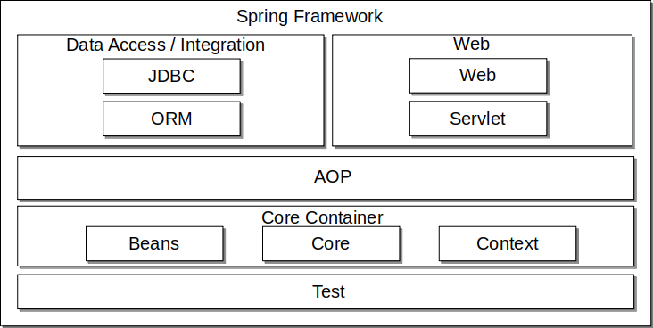

# Spring Framework
 스프링은 애플리케이션에서 사용할 수 있는 프레임워크이다.
 
 ## 스프링의 역할
 스프링은 프레임워크이지만, Struts 같은 웹 애플리케이션 개발용 프레임워크와는 용도가 다르다.
 스프링은 '애플리케이션 프레임쿼크'라는 이름에 걸맞게 어떤 애플리케이션에도 적용할 수 있다.
 스프링은 기술적으로 `의존 관계 주입(DI)`과 `AOP`를 핵심으로 하고있다.
 
 ## 스프링을 활용하기 위한 설계
 스프링을 활용하려면 입터페이스 기반 설계를 이해하는 것이 중요하다. 의존 관계는 구상 클래스가 아닌, 인터페이스를 통해 이뤄지기 때문이다.
 
 ## 싱글턴 (Singleton)
 스프링은 기본적으로 인스턴스를 싱글턴으로 생성한다.
 싱글턴이란, 오직 하나의 객체만을 생성할 수 있는 클래스이다. 싱글턴 패턴을 사용하면 객체의 유일성을 보장할 수 있다.
 
 ## 스프링을 구성하는 모듈
 
 - Core, Beans
 스프링의 핵심 모듈. Bean 컨테이너 관련 기능을 제공한다.
 - Context
 국제화(il8N)나 Java EE가 제공하는 몇몇 기능(JNDI, EJB, JMX)을 지원한다.
 - AOP
 AOP(관점지향 프로그래밍) 기능을 제공하는 모듈
 - ORM
 ORM(Object Relational Mapping) 기능을 제공하는 모듈. ORM API (JPA나 Hibernate, iBatis, JDO 등)를 지원한다.
 - JDBC
 JDBC 추상화 기능을 제공하는 모듈. JDBC에 의한 데이터베이스 액세스를 지원하며, 트랜잭션 관리의 기반이 된다.
 - Web
 파일 업로드 같은 웹애플리케이션 이용에 편리한 기능을 제공한다.
 - Web Servlet
 웹애플리케이션에 MVC 프레임워크 기능을 제공한다.
 - Test
 JUnit이나 TestNG를 사용한 테스트를 지원한다. 여러 테스트 시나리오로 활용할 수 있는 목(mock) 객체도 제공한다.
 ## [DI](https://github.com/j096/cs-study/tree/master/Framework/Spring_Framework/DI)
 
 ## [AOP](https://github.com/j096/cs-study/tree/master/Framework/Spring_Framework/AOP)
 

 
