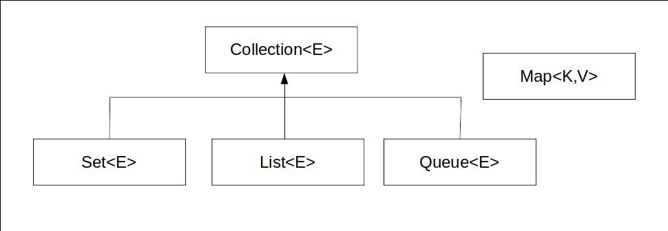

# 컬렉션 프레임워크

자바에서 말하는 프레임워크는 **잘 정의된 구조의 클래스들** 을 의미한다. 즉, 프레임워크는 잘 정의된 클래스들의 모임이라 할 수 있다.

컬렉션 프레임워크는 데이터의 저장 방법과 이와 관련 있는 알고리즘에 대한 프레임워크이다. 자료구조와 알고리즘을 제네릭 기반의 클래스와 메소드로 미리 구현해 놓은 결과물이다.

## [List<E>](https://github.com/j096/cs-study/tree/master/Language/JAVA/Collection_Framework/List)

## Set<E>

## Queue<E>

## Map<K,V>

## 컬렉션 기반 알고리즘

